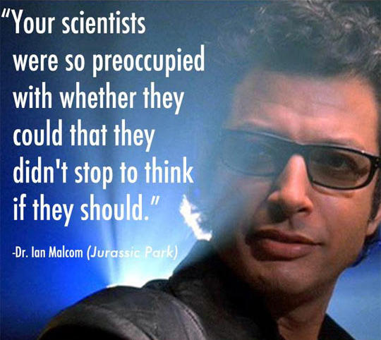
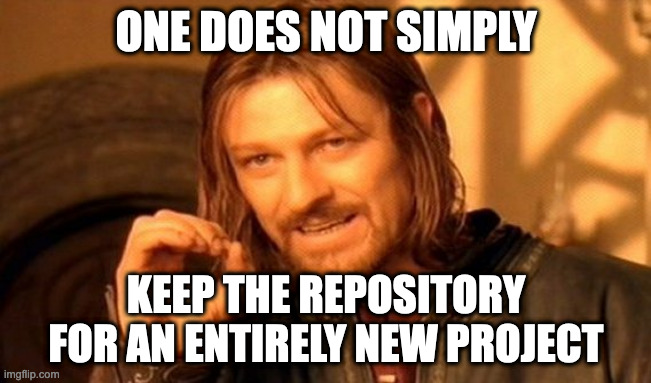
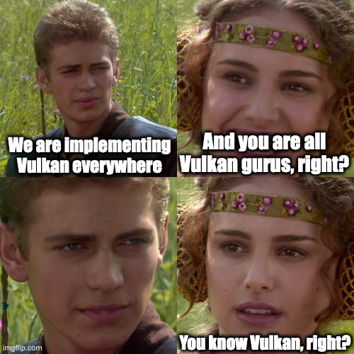
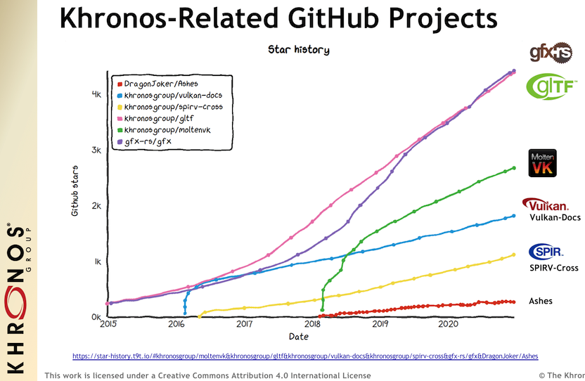

# gfx-rs: lessons learned


Dzmitry Malyshau
Rust Graphics Meetup - 02 Oct 2021

<!-- ts: 0:20 -->

---

# Intro

What is gfx-rs?

RIP 2014 - 2021

<!-- footer: '
As many projects, it started with something that is very far from what it ended.

We will go through case studies and extact lessons. With some memes to help.
' -->

<!-- ts: 1:00 -->

---

# Epoch: pre-ll

2014 - 2018

## Let's try to minimize a chance for errors!
- vertex layouts
- resource bindings
- render targets

<!-- footer: '' -->
<!-- ts: 2:00 -->
---

## Macros

```rust
gfx_defines!{
    vertex Vertex {
        pos: [f32; 4] = "a_Pos",
        tex_coord: [f32; 2] = "a_TexCoord",
    }
    pipeline pipe {
        vbuf: gfx::VertexBuffer<Vertex> = (), //<-- init-time portion
        out_color: gfx::RenderTarget<ColorFormat> = "Target0",
    }
}
...
let data = pipe::Data { // bind-time portion
    vbuf: vbuf, // it was long ago!
    out_color: window_targets.color,
};
```
<!-- ts: 3:00 -->
---

### Result
Users constantly misunderstanding the difference between macro-derived structures: one for initialization, one for run-time binding.

Macros were also very difficult to write and debug, not properly supported by tools.

---

### Lesson-1
_Stay away from macros_, unless strictly necessary.

<!-- footer: '
We used them because we were still learning the 
language (way before 1.0), no best practices were known.
' -->
<!-- ts: 4:00 -->
---

## Function-style draw calls
```rust
    /// Draws a `slice::Slice` using a pipeline state object,
    /// and its matching `Data` structure.
    pub fn draw<D: pso::PipelineData<R>>(&mut self,
        slice: &slice::Slice<R>,
        pipeline: &pso::PipelineState<R, D::Meta>,
        user_data: &D)
```
Most state is explicitly provided for each draw, then compared against the current to generate the state changes internally.

<!-- footer: '' -->
<!-- ts: 4:45 -->
---

### Result
Users saving the fat "data" objects and mutating them between the draws. Effectively, re-introducing the same state we tried to remove!

Their responsibility to fail, but still our problem.
A good API shows the trail to success, not placing traps on the way.

Also, deducing the internal state changes means the overhead is not explicit, and is harder to reason about.

<!-- ts: 5:45 -->
---

### Lesson-2
_Functional style isn't universally better_. It needs to be practical and match the target domain. Computer graphics is inherently stateful, and there is a performance cost to trying to change this.

<!-- footer: '
Stack-based approach might have been better: [Luminance](https://github.com/phaazon/luminance-rs) has some of it.
' -->
<!-- ts: 6:45 -->
---

## Run-time knowledge

But what if we don't know this at compile time?..

Armed with type system, we can do it at run-time!
```rust
impl<'a> DataLink<'a> for RawRenderTarget {
    type Init = (&'a str, format::Format,
        state::ColorMask, Option<state::Blend>);
    ...
}
```

<!-- footer: '' -->
<!-- ts: 7:45 -->
---



<!-- ts: 8:00 -->
---

### Result
Even more *confusion*!
Users basically followed the magic incantations without fully understanding them.

---

### Lesson-3
_Always build types *over* plain data_, not the other way around.
If unsure, start with simple data and functions. Make typed layer optional.

<!-- footer: '
In this case, the user should choose between using typed layer or not typed. Instead, they picked between the typed layer and the raw typed abomination over it.

Somewhat related to Vulkano.
' -->
<!-- ts: 9:00 -->
---

## Pipelines

In the API users defined graphics pipelines. This matches the concept in modern APIs, but at that point gfx pre-ll only had OpenGL support. Later it got DX11.

> We are ready for the next gen!

<!-- footer: '
We can eliminate a class of errors by requiring users to provide all information every time... Does not solve the problem.
' -->
<!-- ts: 10:00 -->
---

### Result
pre-ll pipelines never ended up being translated into the *real* graphics pipelines of modern APIs. There were other obstacles preventing the modern backends to be written (object lifetime on GPU, descriptors, etc).

<!-- footer: '' -->

---

### Lesson-4
_Don't design for the unknown future_. Design for the known today instead.

There are many reasons for the design to need to change, and clarifying the future is just one of them.

<!-- footer: '
Very similar to the advice you can read on various
posts and threads, e.g. on HN.
' -->
<!-- ts: 11:30 -->
---


### Lesson-5

_Users need solutions_. A GPU abstraction without a common entry point for shaders is just a part of a solution.

<!-- footer: '' -->
<!-- ts: 12:0 -->
---

# Epoch: gfx-hal

Oct 2017 - Summer 2021

## Let's expose the lowest level

---

## API Alignment
Follow **Vulkan** precisely, worship **Khronos**. Participate in [Vulkan Portability Initiative](https://www.vulkan.org/portability)

Include all the nasty details, like render sub-passes and explicit memory control (i.e. be unopinionated)

<!-- ts: 13:00 -->
---



https://github.com/gfx-rs/gfx

<!-- ts: 13:20 -->

---

### Lesson-6
Users *still* get confused on what gfx-rs is.

Branding is important. Heritage needs to be preserved. Replacing the project on the same repository with a different one causes too much pain and confusion in the long run.

<!-- footer: '
Transition killed most of the contributors and users.
' -->
<!-- ts: 14:00 -->
---

## Zero-cost abstraction

```rust
    unsafe fn bind_vertex_buffers<I, T>(
        &mut self, first_binding: pso::BufferIndex, buffers: I
    ) where
        I: IntoIterator<Item = (T, buffer::SubRange)>,
        T: Borrow<B::Buffer>,
        I::IntoIter: ExactSizeIterator;
```

<!-- footer: '
There are always costs: debug run-time cost, compile time cost, maintenance cost, mental overhead.'
-->
<!-- ts: 15:00 -->
---

### Result
Wasting time trying to navigate the types jungle.

### Lesson-7
Types can be overwhelming and inefficient. They hinder debugging, compile times, API usability.
Reaching safety with run-time checks is a perfectly valid alternative.

<!-- footer: '' -->
<!-- ts: 16:00 -->
---



<!-- ts: 16:20 -->
---

Put a ton of trust into Vulkan as well as **ourselves**.

### Result
Vulkan is complicated. Really.
There is a lot of complexity, and a lot of tribal knowledge.

And we signed oursevels to be *slaves* of the decisions made by Vulkan working group.

<!-- ts: 17:30 -->
---


---

### Lesson-8
_Recognize your assumptions and wishful thinking._

If something is open and developed in collaboration, we **want** it to be the best thing in the world. But we should not assume that.

An API developed behind closed doors with tight feedback loop from developers can feature better designs.

<!-- footer: '
Examples: copy alignments, sub-passes, resource states.
' -->

---


<!-- footer: '' -->
---

### Result
We couldn't build any decent high-level abstraction... Users were crushing into the complexity and leaving.

### Lesson-9a
_Put users first_. Serve real needs.

Building the foundation without a good understanding of higher levels is a recipe for disaster.

<!-- footer: '
I.e. could bring wgpu-rs *before* gfx-hal.
' -->

---

### Lesson-9b
Being universal and unopinionated is *not* a feature. It's an instrument to build something **actually useful** on top. 
But once it's build, there is an inevitable temptation to avoid compromises. **Opinionated >> Universal**.

<!-- footer: '' -->
---

### Lesson-9c
Low level primitives are as **re-usable** as narrow their API is. gfx-hal API is large.

<!-- footer: '
If gfx-hal had a smaller API, there would be much higher chance for other libraries to pick it up and build on top.
' -->

---

### Result
We built gfx-portability and beat MoltenVK in performance... **Nobody cared:**
  - Rust users don't care about C APIs
  - C users just need something that survives long enough

### Lesson-10
Fighting against the flow is hard

<!-- footer: '
Nobody woke up in the morning thinking:
I am going to make VkPi run superb for my app.
' -->

---

## Community


Commits: 6K+
Contributors: 255, and growing
Code: 65K LOC, and growing
**Maintainers: 1**

<!-- footer: '' -->
<!--
- "Initial stub for mesh shaders" +785 −335
- "Direct display feature" +1,483 −80
- "External memory feature" +3,279 −121
- "Acceleration structure API proposal" +3,703 −67
-->

---



---

### Lesson

Contributor/commit counts and project stats are unlikely important, at all.

Some contributions are harmful. Can't expect the authors to maintain their code. Smaller scope is a hidden advantage.

---

# Epoch: wgpu-hal

Summer 2021 - future

## Keep it simple, keep it close

---

## Design
Follow WebGPU where it's reasonable.
Unlike Vulkan, WebGPU is designed to map to other APIs.

Metrics: 2.5-3x less code, faster compile times.

---

# what's next?

gfx-rs repository is in **maintenance** mode.
But the ideas of gfx-rs live on within wgpu-hal and wgpu-rs.

--- 

### Further reading
- https://gfx-rs.github.io/2021/07/16/release-0.9-future.html
- http://kvark.github.io/3d/api/vulkan/2021/06/20/vulkan-alignment.html
- https://github.com/gfx-rs/portability/issues/250
