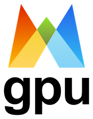

# wgpu: re-organized

Dzmitry Malyshau, 2021

---

---

# Current: the Good

One and only safe graphics/compute API in Rust (at least, in theory).

Full Rust stack (on Vulkan and Metal so far), including shader processing.

Backed by an actual [specification](https://gpuweb.github.io/gpuweb/), which `wgpu` is informing.

Used in Gecko, Servo, and Deno. Formed a large community with [interesting projects](https://github.com/gfx-rs/wgpu-rs/wiki/Applications-and-Libraries).

Solid execution on Vulkan and Metal, while DX12 is mostly usable.

--- 

# Current: the Bad

Naga updates go in trains through `naga`-`gfx-rs`-`wgpu`-`wgpu-rs` reporitories. The ones in the middle are not well tested, there is a chance for downstream breakage.

Developing and landing large changes is hard. Multiple PRs may be needed, kept in sync.

gfx-rs has Vulkan-like API boundary. Translating to Metal, DX12/DX11, and most importantly - to OpenGL, introduces friction and potential overhead.

Adding features that are not Vulkan-ic is a challenge.

---

# Current: the Ugly

`wgpu` is developed on GitHub but also is vendored into Mozilla-central (under `/gfx/wgpu`). We tried to establish synchronization between them, but it was very fragile.

Users get constantly confused about where the code lives, where to file issues.

`gfx-rs` has a lot of functionality not tested or used by `wgpu` in any way: resuable command buffers, render sub-passes, even mesh shaders.

Testing is easiest with Rust API, which lives separately from the implementation.

---

# The Big Reorg

1. **Move Rust API** into the same repo as the logic (merge `wgpu-rs` into `wgpu`).
2. **Relicense** under MIT + Apache2 (to allow forks to be ported on consoles).
3. **Move GPU abstraction** into the same repo (merge gfx-rs into `wgpu`).

---

# Future

One stop for all the GPU needs, changes, and discussions: https://github.com/gfx-rs/wgpu

Combines all the implementation logic, debug infrastructure, tests, and Rust bindings.

Streamlined developer experience, solid CI coverage.

---

# wgpu-hal

Sane low-level GPU abstraction, born as a mix of WebGPU API with `gfx-hal`.

Lean implementation, near-zero overhead. No state, lifetime, or dependency tracking.

*Explicit resource state transitions* based on WebGPU-defined internal states. Similar mechanics to DX12 but without implicit promotion/decay.

*Explicit binding layouts*, synchronization via timeline fences.

Implicit memory allocation, but with persistent mapping.

Fully *unsafe*, but actually usable to build your own abstractions.

---

# Timeline

  1. land `wgpu-hal` with Vulkan + Metal (June 2021)
  2. release on `crates` (June/July 2021)
  3. port DX12, DX11, and GLES backends (Aug+ 2021)

Help is appreciated!

---

# Questions?

@kvark
@cwfitzgerald
@grovesNL

Discussions:
- https://github.com/gfx-rs/gfx/discussions/3768
- https://github.com/bevyengine/bevy/discussions/2265
